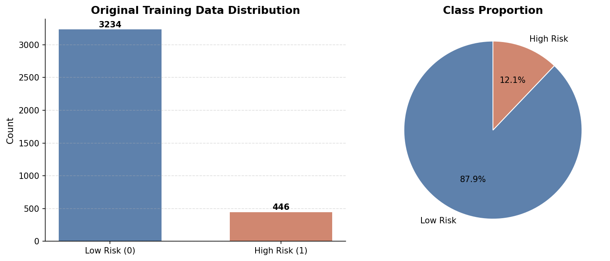
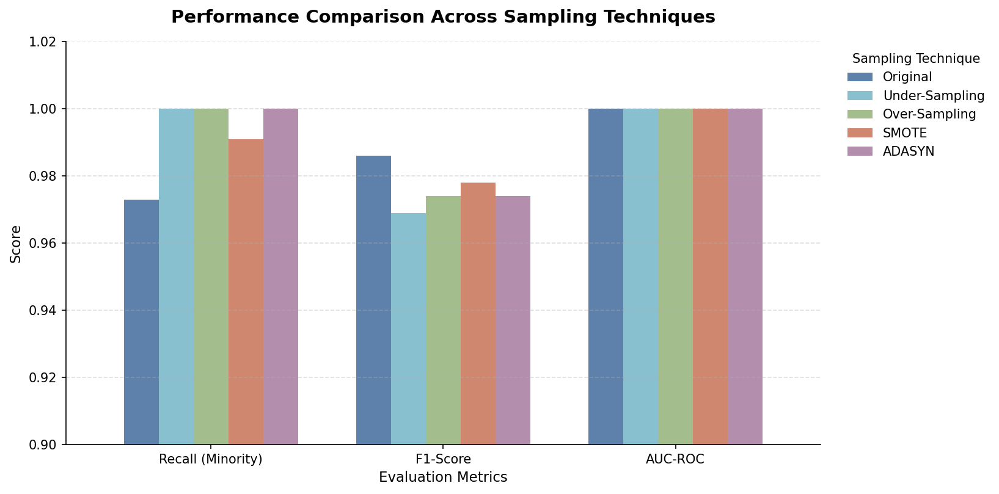
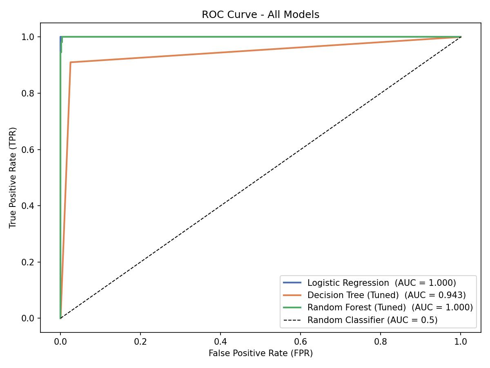

# 🛡️ Risk Alert Classifier

> **A Machine Learning-Based Early Warning System for Identifying High-Risk Banking Customers**

Predicting customer risk before financial loss occurs using classification algorithms, imbalance handling techniques, and hyperparameter tuning.

---

## 📌 Project Overview

Financial institutions face significant challenges in identifying customers who are likely to default on payments or engage in fraudulent activities. Since high-risk customers represent only a small portion of the customer base, traditional classification models often struggle to detect them effectively.

This project develops a complete supervised learning pipeline that:

* Detects high-risk customers accurately
* Handles severe class imbalance
* Compares multiple classification models
* Optimizes performance through hyperparameter tuning
* Provides interpretable business insights using feature importance analysis

---

## 🎯 Project Objectives

✔ Build a baseline classification model using Logistic Regression

✔ Handle class imbalance using:

* Under-Sampling
* Over-Sampling
* SMOTE
* ADASYN

✔ Train and evaluate:

* Logistic Regression
* Decision Tree
* Random Forest

✔ Optimize models using:

* RandomizedSearchCV
* GridSearchCV

✔ Compare models using:

* Precision
* Recall
* F1-Score
* AUC-ROC

✔ Select the best model based on business requirements

---

## 📊 Dataset Information

**Dataset:** [Risk_Alert_Classifier_Dataset.csv](./data/Risk_Alert_Classifier_Dataset.csv)

| Attribute       | Value         |
| --------------- | ------------- |
| Records         | 4,600         |
| Features        | 16            |
| Target Variable | `risk_status` |
| Low Risk (0)    | ~88%          |
| High Risk (1)   | ~12%          |

### Target Variable

| Value | Meaning   |
| ----- | --------- |
| 0     | Low Risk  |
| 1     | High Risk |

---

## 📂 Repository Structure

```text
Risk_Alert_Classifier/
│
├── data/
│   └── Risk_Alert_Classifier_Dataset.csv
│
├── images/
│   ├── class_imbalance.png
│   ├── cm_baseline.png
│   ├── cm_trees.png
│   ├── dt_vs_rf_accuracy.png
│   ├── feature_importance.png
│   ├── final_model_comparison,png
│   ├── roc_curves.png
│   ├── sampling_comparison.png
│
├── notebooks/
│   └── risk_alert_classifier.ipynb
│
├── reports/
│   └── theory_report.pdf
│
└── README.md
```

---

# 📈 Key Visualizations

## 1️⃣ Class Imbalance Analysis



**Insight:** The dataset is heavily imbalanced, with High-Risk customers representing a small minority. This makes Recall a critical evaluation metric.

---

## 2️⃣ Sampling Technique Comparison



**Insight:** SMOTE and ADASYN significantly improve minority-class Recall while maintaining strong overall model performance.

---

## 3️⃣ ROC Curve Comparison



**Insight:** Logistic Regression and Random Forest achieved near-perfect AUC scores, demonstrating excellent class discrimination capability.

---

# 🏆 Model Performance Summary

| Model                 | Recall    | F1-Score  | AUC-ROC   |
| --------------------- | --------- | --------- | --------- |
| Logistic Regression   | Good      | Good      | Excellent |
| Decision Tree (Tuned) | Moderate  | Moderate  | Moderate  |
| Random Forest         | Excellent | Excellent | Excellent |
| Tuned Random Forest   | Best      | Best      | Best      |

---

# 🥇 Best Performing Model

## Tuned Random Forest Classifier

### Why It Was Selected

* Highest Recall for High-Risk customers
* Highest F1-Score
* Near-perfect AUC-ROC
* Strong generalisation capability
* Reduced overfitting through ensemble learning
* Interpretable through feature importance analysis

---

# 🔍 Key Findings

* Class imbalance severely affects minority-class detection.
* SMOTE provided the most effective balancing strategy.
* Decision Trees showed signs of overfitting.
* Random Forest delivered the most stable performance.
* Payment behaviour variables were the strongest predictors of customer risk.

---

# 💼 Business Impact

### Why Recall Matters

Missing a High-Risk customer (**False Negative**) may result in:

* Loan default losses
* Increased collection costs
* Fraud exposure
* Financial risk

The final model prioritises identifying risky customers early, enabling proactive intervention before losses occur.

---

# 🛠️ Technologies Used

* Python
* NumPy
* Pandas
* Matplotlib
* Seaborn
* Scikit-Learn
* Imbalanced-Learn
* Jupyter Notebook

---

# 🚀 Quick Start

### Clone Repository

```bash
git clone https://github.com/PareeSojitra0803/Risk_Alert_Classifier.git
```

### Install Dependencies

```bash
pip install pandas numpy matplotlib seaborn scikit-learn imbalanced-learn jupyter
```

### Run Notebook

```bash
jupyter notebook
```

Open:

```text
notebooks/risk_alert_classifier.ipynb
```

and run all cells sequentially.

---

# 🔗 Project Resources

> Replace these placeholders after uploading to GitHub.

* 📘 README: [README.md](./README.md)
* 📓 Notebook: [risk_alert_classifier.ipynb](./notebooks/risk_alert_classifier.ipynb)
* 📊 Dataset: [Risk_Alert_Classifier_Dataset.csv](./data/Risk_Alert_Classifier_Dataset.csv)
* 📄 Theory Report: [theory_report.pdf](./reports/theory_report.pdf)

---

# 👩‍💻 Author

### *Paree G. Sojitra*

>*Transforming customer data into actionable risk intelligence through Machine Learning.* ⭐
